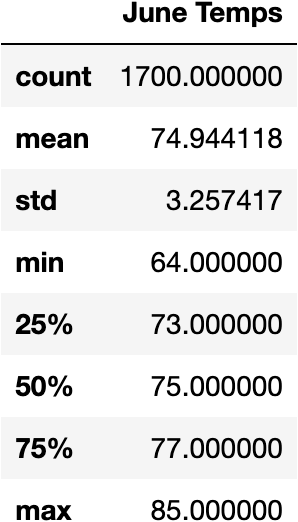

# Surfs Up Analysis :ocean:

## Overview

    In this analysis we are looking at the temperature trends before opening a surf shop. 
    Specifically looking at the temperature data for the months of June and December in Oahu,Hawaii in order to 
    determine if the surf and icecream shop is sustainable year round.

    This analysis will be done using python, pandas functions, and SQLalchemy.

## Results

  ### June Summary of Statistics
    
    * Retrieval of June temperautures has shown that the average temperautre is 74.9. 
    * The average low temperature is 64 and the high averages 85 degrees. 
    * 1,700  data points were counted to obtain this information.

### December Summary of Statistics

    * Next we retrieved the temperatures for the month of December.
    *  The analysis shows that the mean temperature for December is 71. 
    *  The minimum temperature is 56 and the maximum average temperature is 83. 
    *  There were 1,517 data points counted in this analysis.

## Summary

  * When all the data collected was analyzed we can see that there is a difference of a few degrees between the months of June and December. June has higher average temperatures. Looking at the highs there is only a difference of a couple degrees, but when it comes to the lows there is a difference of ten degrees.June still maintaining higher temperatures.

  Overall it looks like June has better weather for surfing and icecream throughout the day. Although there are similar temperatures in December. Sales during the day should be sustainable,but may decline in the evening hours.